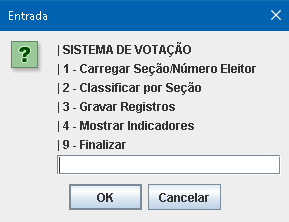
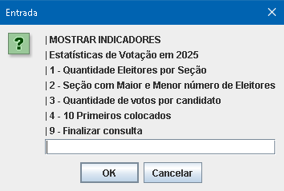
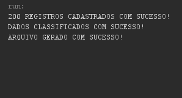
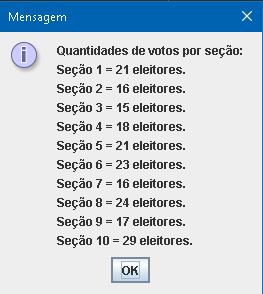
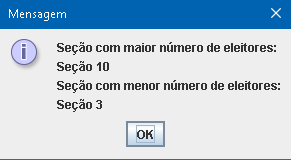
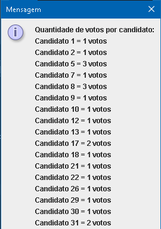
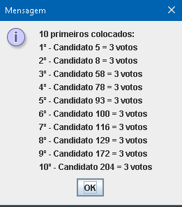
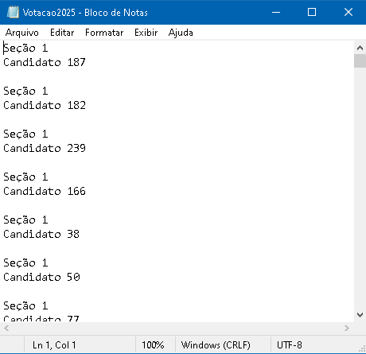
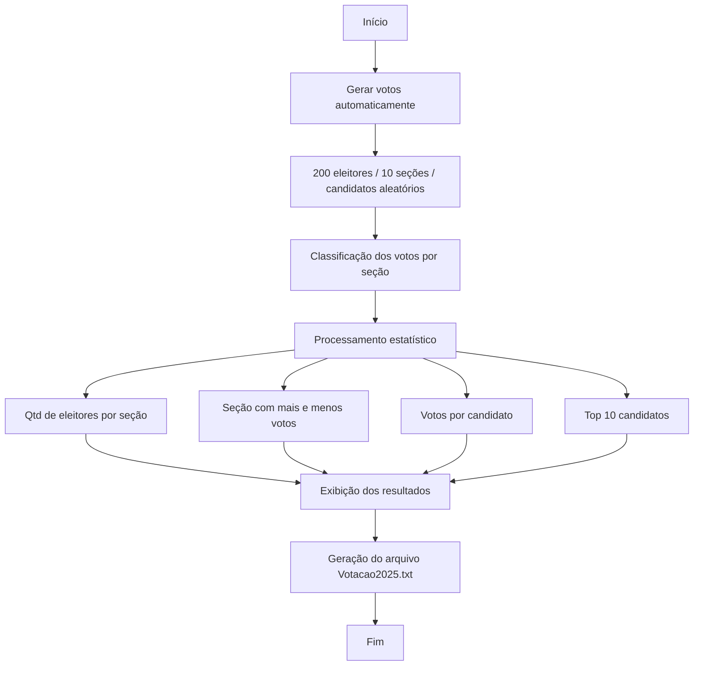

# Sistema de Votação 2025

Sistema em Java para simulação de votação com geração aleatória de votos, organização por seção e candidato, análise estatística e exportação de resultados para arquivo ``.txt``.

**Nota: O ano decrito no código é meramente ilustrativo e não corresponde a eleições reais.**

---

## Visão Geral

O projeto simula um processo de votação com 200 eleitores distribuídos em 10 seções, gerando automaticamente votos aleatórios para candidatos. A partir desses dados, o sistema realiza o processamento e a análise dos resultados.

---

## Demonstração
### Menu principal do sistema
<p align="center">
  
</p>

### Menu "Mostrar Indicadores"
<p align="center">
  
</p>

### Geração de dados no sistema
<p align="center">
  
</p>

### Estatísticas geradas
<p align="center">
  
</p>
<p align="center">
  
</p>
<p align="center">
  
</p>
<p align="center">
  
</p>


## Arquivo Votacao2025.txt
<p align="center">
  
</p>

---

## Funcionalidades
- Geração automática de votos para 200 eleitores
- Distribuição de votos entre 10 seções
- Registro de número de candidato e seção
- Classificação dos votos por seção
- Identificação de:
  - Seção com mais e menos eleitores
  - Quantidade de votos por candidato
  - Top 10 candidatos mais votados
- Geração de arquivo ``.txt`` com os registros

---

## Estrutura do Projeto

- `ClassePrincipal.java`  
  - Classe principal que executa o sistema e apresenta o menu de opções.
- `ClasseMetodos.java`  
  - Contém todos os métodos de geração de votos, classificação, gravação em arquivo e exibição de indicadores.
- `Votacao.java`  
  - Classe que representa cada voto, contendo `NumeroSecao` e `NumeroCandidato`.

---

## Fluxo do sistema



## 🧰 Tecnologias Utilizadas

| Tecnologia | Uso principal |
|-------------|----------------|
|  **Java SE** | Linguagem base |
|  **JOptionPane (Swing)** | Interface de entrada e saída |
|  **BufferedWriter / FileWriter** | Manipulação de arquivos |
|  **Random** | Geração automática de dados |

## Como Executar

1. Clonar o repositório:

```
git clone https://github.com/seu-usuario/sistema-de-votacao.git
```

2. Compilar os arquivos Java
```
javac ClassePrincipal.java ClasseMetodos.java Votacao.java
```

3. Executar a aplicação
```
java ClassePrincipal
```

---

## 👩‍💻 Autora
### Emily Rharysa
#### 💻 Desenvolvedora Web | Estudante de Tecnologia
#### 📫 [LinkedIn](https://www.linkedin.com/in/emyrhf/)
