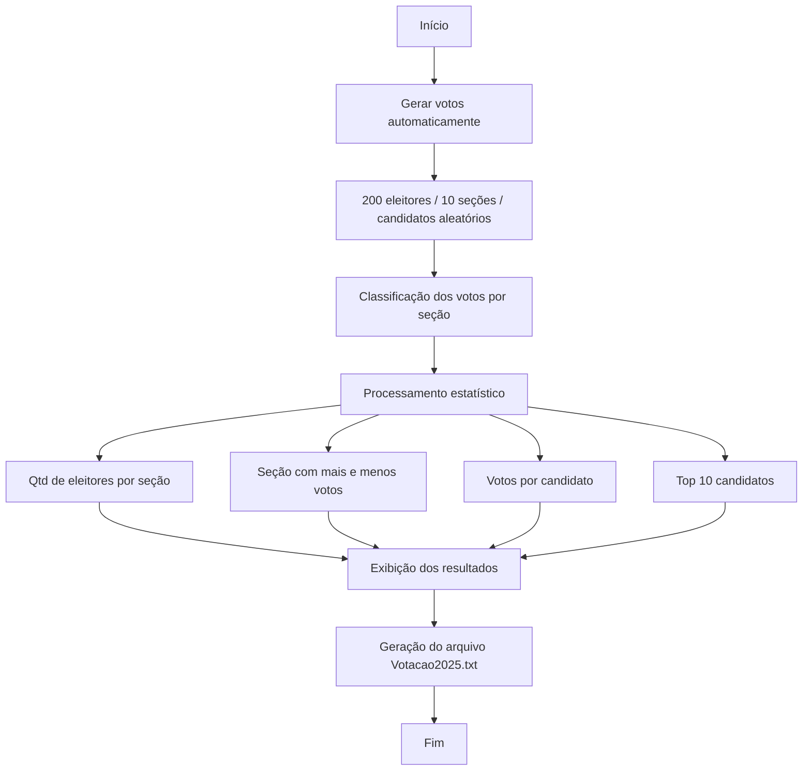

# Sistema de Votação 2025


Sistema em **Java** para simulação de um processo de votação, com geração automática de votos, organização por seção e candidato, análise estatística dos resultados e exportação para arquivo `.txt`.

> **Nota:** o ano descrito no nome do projeto e no código é meramente ilustrativo e não corresponde a eleições reais. Todos os dados (eleitores, seções, candidatos e votos) são gerados de forma pseudoaleatória, sem qualquer vínculo com processos eleitorais efetivos.

---

## Sumário

1. [Visão Geral](#visão-geral)
2. [Contexto Acadêmico](#contexto-acadêmico)
3. [Arquitetura e Estrutura do Projeto](#arquitetura-e-estrutura-do-projeto)
4. [Pré-requisitos e Dependências](#pré-requisitos-e-dependências)
5. [Como Executar](#como-executar)
6. [Funcionalidades](#funcionalidades)
7. [Metodologia e Decisões de Design](#metodologia-e-decisões-de-design)
8. [Licença e Contato](#licença-e-contato)

---

## Visão Geral

O projeto simula um processo de votação com **200 eleitores** distribuídos em **10 seções**, gerando automaticamente votos para candidatos. A partir desses dados, o sistema realiza processamento estatístico e apresenta indicadores como distribuição de votos por seção, votos por candidato e ranking dos mais votados.

---

## Contexto Acadêmico

Este projeto foi desenvolvido como exercício prático de Programação Orientada a Objetos em Java, com foco em geração e manipulação de grandes volumes de dados simulados, classificação/agrupamento de registros e cálculo de indicadores estatísticos, além da persistência dos resultados em arquivo.

---

## Arquitetura e Estrutura do Projeto

O sistema é organizado em três classes Java, com separação entre execução/apresentação, lógica de processamento e modelo de dados:

```text
Votacao2025/
├── ClassePrincipal.java   # Classe principal; executa o sistema e apresenta o menu de opções
├── ClasseMetodos.java     # Geração de votos, classificação, gravação em arquivo e cálculo de indicadores
├── Votacao.java           # Classe de modelo: representa um voto (NumeroSecao, NumeroCandidato)
└── Votacao2025.txt        # Arquivo de saída gerado em tempo de execução
```

| Classe | Responsabilidade |
|---|---|
| `ClassePrincipal` | Ponto de entrada da aplicação; exibe o menu principal e direciona o fluxo conforme a opção selecionada. |
| `ClasseMetodos` | Concentra a lógica de negócio: geração automática de votos, classificação por seção, cálculo de indicadores estatísticos e gravação em arquivo. |
| `Votacao` | Classe de modelo (POJO), representando um voto individual por meio de `NumeroSecao` e `NumeroCandidato`. |

### Fluxo do sistema



---

## Pré-requisitos e Dependências

| Requisito | Especificação |
|---|---|
| JDK (Java Development Kit) | Java SE |
| Bibliotecas externas | Nenhuma — utiliza exclusivamente a biblioteca padrão do Java |
| Pacotes da biblioteca padrão utilizados | `javax.swing.JOptionPane`, `java.io.BufferedWriter`, `java.io.FileWriter`, `java.util.Random` |
| Sistema de build | Não utilizado — compilação direta via `javac` |

---

## Como Executar

```bash
git clone https://github.com/seu-usuario/sistema-de-votacao.git
```

```bash
javac ClassePrincipal.java ClasseMetodos.java Votacao.java
```

```bash
java ClassePrincipal
```

---

## Funcionalidades

- Geração automática de votos para 200 eleitores.
- Distribuição de votos entre 10 seções.
- Registro de número de candidato e de seção para cada voto.
- Classificação dos votos por seção.
- Identificação da seção com mais e com menos eleitores.
- Cálculo da quantidade de votos por candidato.
- Ranking dos 10 candidatos mais votados.
- Geração de arquivo `.txt` com o registro consolidado dos resultados.

---

## Metodologia e Decisões de Design

**1. Separação entre modelo, lógica e apresentação.**
`Votacao` concentra o estado de cada registro de voto, `ClasseMetodos` concentra as regras de geração e processamento estatístico, e `ClassePrincipal` concentra a interação com o usuário — evitando o acoplamento entre a lógica de cálculo e a camada de interface.

**2. Geração pseudoaleatória de dados em escala.**
Diferentemente de projetos com poucos registros manuais, este sistema gera 200 registros de voto por execução por meio da classe `Random`. Essa escala foi adotada propositalmente para exercitar estruturas de repetição, agregações (contagem, ranking) e agrupamento por seção em um volume de dados que não seria praticável informar manualmente.

**3. Ausência de vínculo com dados eleitorais reais.**
O sistema não consulta, reproduz ou representa dados de eleições reais — trata-se de uma simulação com fins exclusivamente didáticos, o que é explicitado tanto no nome quanto na documentação do projeto para evitar qualquer interpretação equivocada dos resultados gerados.

**4. Interface via `JOptionPane` (Swing) e persistência em arquivo texto.**
Assim como em projetos correlatos da mesma autora, optou-se por caixas de diálogo do Swing para entrada/saída e por gravação simples em `.txt` (via `BufferedWriter`/`FileWriter`), dispensando banco de dados. *Trade-off*: adequado ao escopo do exercício, mas sem suporte a consulta estruturada ou persistência entre execuções além do arquivo de saída.

---

## Licença e Contato

**Licença:** este projeto é distribuído sob a **Licença MIT**. Isso permite uso, cópia, modificação, fusão, publicação, distribuição, sublicenciamento e/ou venda de cópias do software, desde que o aviso de copyright e a nota de permissão sejam incluídos em todas as cópias ou partes substanciais do software. O software é fornecido "no estado em que se encontra", sem garantias de qualquer tipo. Caso o arquivo `LICENSE` ainda não exista na raiz do repositório, recomenda-se sua criação com o texto oficial da licença MIT, disponível em [https://opensource.org/license/mit](https://opensource.org/license/mit).

**Autoria e manutenção:**

| Papel | Nome | Contato |
|---|---|---|
| Autora | Emily Furtado | emyrhf.dev@gmail.com |

**Repositório:** [Sistema de Votação](https://github.com/emyrhf/Sistema-de-Votaca)
